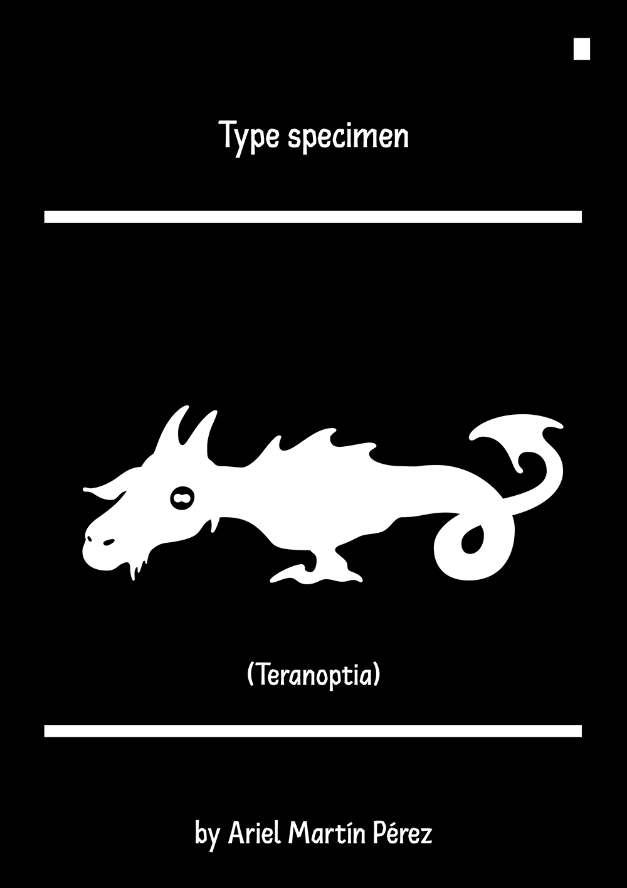
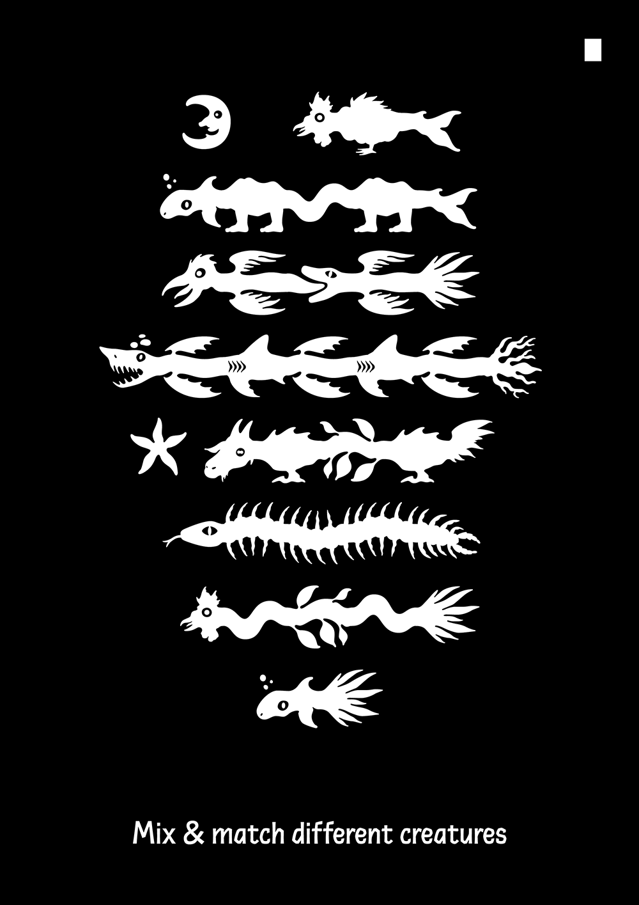
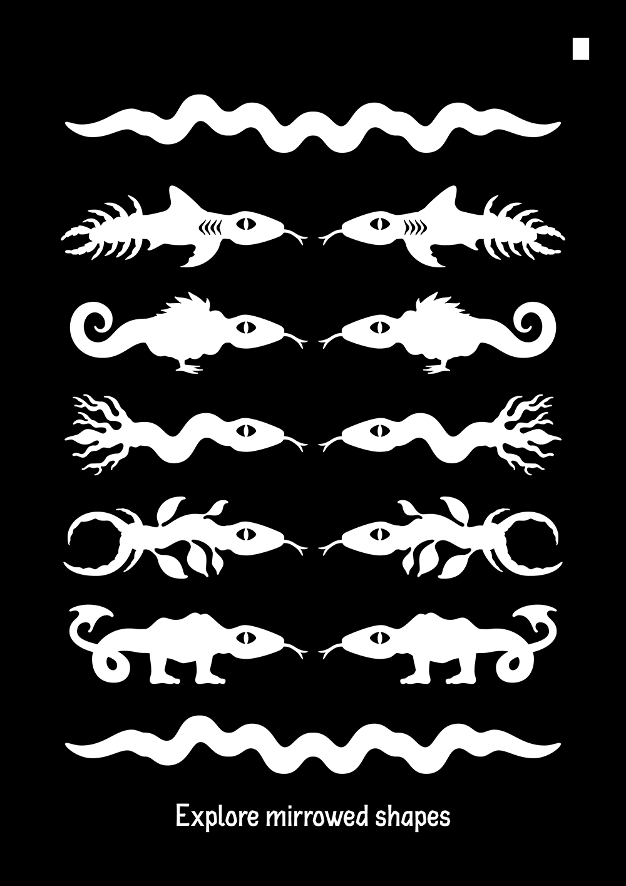
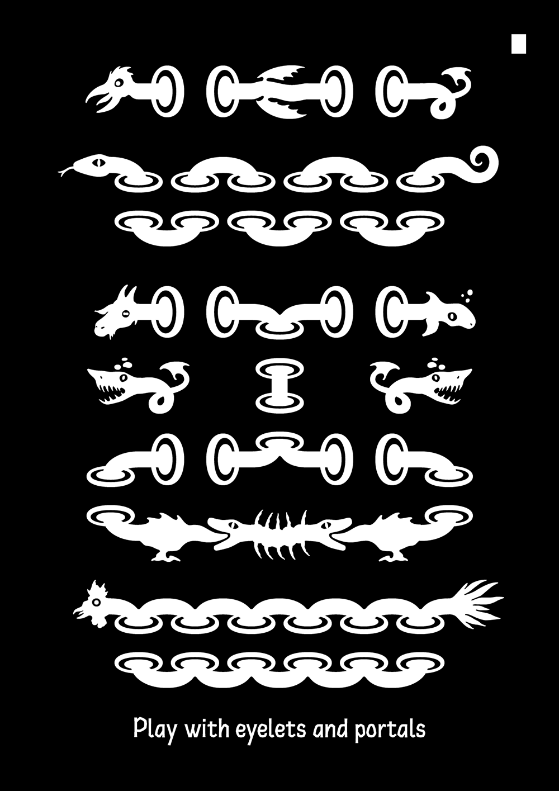

# Teranopia

<strong>[EN]</strong>

Teranoptia is a typeface without letters, a peculiar contraption that allows you to imagine chimeric creatures just by typing letters with your keyboard. Its design has been inspired by the Bayeux Tapestry and by medieval illustrations, as well as by children's books. You can use it to create border ornaments, to daydream about monsters or just to spice your layouts with marginalia.

Teranopia has been created by Ariel Martín Pérez (www.appliedmetaprojects.com - contact@appliedmetaprojects.com) and released under the SIL Open Font Licence 1.1 in 2021. Teranopia is distributed by Tunera Type Foundry (www.tunera.xyz).

To know how to use this typeface, please read the FAQ (http://www.tunera.xyz/f.a.q/)

<strong>[FR]</strong>

Teranoptia est un caractère typographique sans lettres, un curieuse invention qui vous permet d'imaginer des créatures chimériques simplement en tapant des lettres sur votre clavier. Son dessin s'inspire de la Tapisserie de Bayeux, d'illustrations médiévales et de livres pour enfants. Vous pouvez l'utiliser pour créer des bords ornementaux, pour rêver de monstres en plein jour ou simplement pour pimenter vos mises en page avec des marginalia.

Teranopia a été créé par Ariel Martín Pérez (www.appliedmetaprojects.com - contact@appliedmetaprojects.com) et publié sous la licence SIL Open Font License 1.1 en 2021. Teranopia est distribué par Tunera Type Foundry (www.tunera.xyz).

Pour savoir comment utiliser cette fonte, veuillez lire la FAQ (http://www.tunera.xyz/fr/f.a.q/)

<strong>[ES]</strong>

Teranoptia es un tipo de letra sin letras, un peculiar artilugio que permite imaginar criaturas quiméricas sólo con teclear. Su diseño está inspirado en el Tapiz de Bayeux y en las ilustraciones medievales, así como en los libros infantiles. Puedes utilizarlo para crear bordes decorativos, para soñar con monstruos o simplemente para aderezar tus maquetas con marginalia.

Teranopia ha sido creado por Ariel Martín Pérez (www.appliedmetaprojects.com - contact@appliedmetaprojects.com) y publicado bajo la licencia SIL Open Font License 1.1 en 2021. Teranopia es distribuido por Tunera Type Foundry (www.tunera.xyz).

Para saber cómo usar este tipo de letra, lea las preguntas frecuentes (http://www.tunera.xyz/sp/f.a.q/)

## Specimen

## License

Teranopia is licensed under the SIL Open Font License, Version 1.1.
This license is copied below, and is also available with a FAQ at
http://scripts.sil.org/OFL

## Repository Layout

This font repository follows the Unified Font Repository v2.0,
a standard way to organize font project source files. Learn more at
https://github.com/unified-font-repository/Unified-Font-Repository
